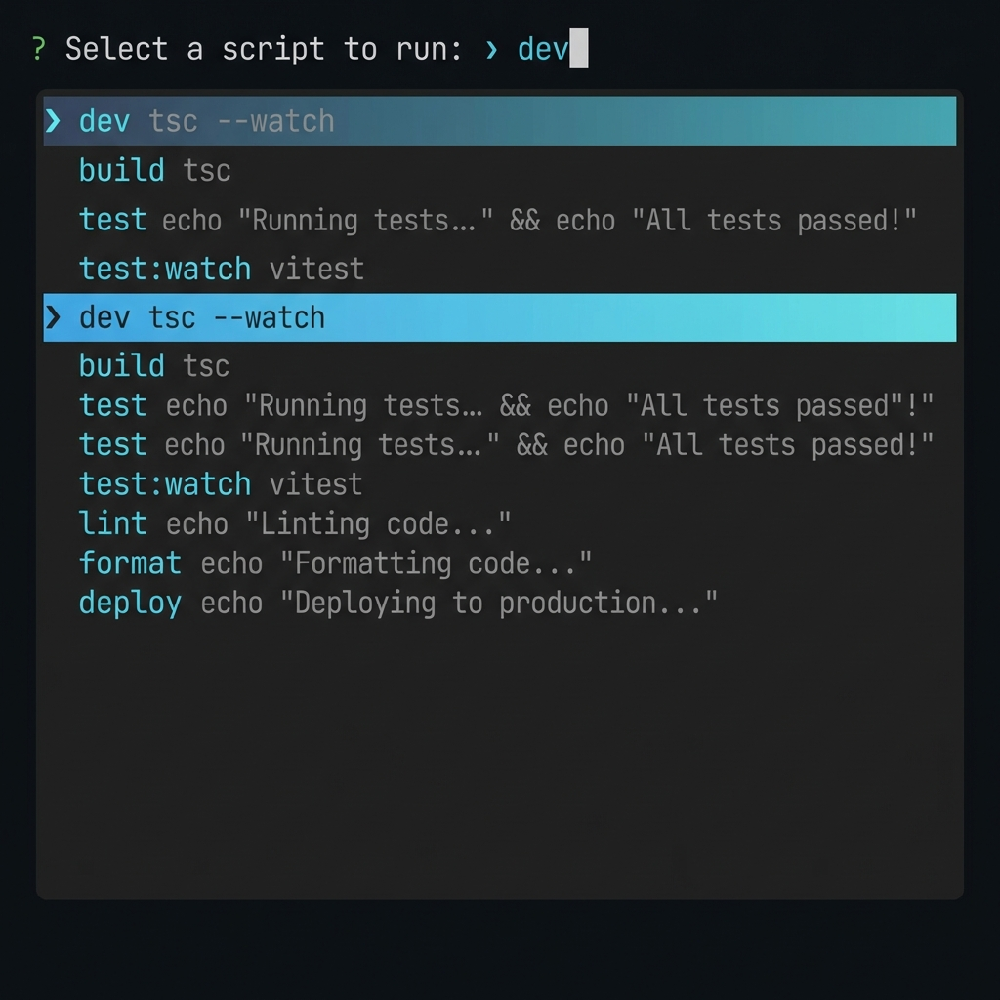

<div align="center">

# 🚀 devrun

**A blazingly fast interactive npm script runner with fuzzy search**

[](https://www.npmjs.com/package/devrun)
[](https://www.npmjs.com/package/devrun)
[](https://opensource.org/licenses/MIT)

[Features](#-features) • [Installation](#-installation) • [Usage](#-usage) • [Why devrun?](#-why-devrun) • [Contributing](#-contributing)

</div>

---

## 🎯 What is devrun?

**devrun** (or `dr` for short) is an interactive CLI tool that makes running npm scripts effortless. No more typing `npm run` repeatedly or trying to remember script names. Just type `dr`, search, and execute!

### 🎬 See it in action



Type to filter scripts instantly with fuzzy search, navigate with arrow keys, and press Enter to run. It's that simple!

---

## ✨ Features

- 🔍 **Fuzzy Search** - Type any part of the script name to filter instantly
- ⚡ **Lightning Fast** - Zero configuration, minimal overhead
- 🎨 **Beautiful UI** - Syntax-highlighted, easy-to-read interface
- ⌨️ **Intuitive Navigation** - Arrow keys and type-ahead filtering
- 📂 **Smart Discovery** - Automatically finds `package.json` in current or parent directories
- 🔥 **Two Commands** - Use `devrun` or the shorter `dr` alias
- 🚫 **Zero Config** - Works out of the box, no setup required

---

## 📦 Installation

### Global Installation (Recommended)

Install globally to use `dr` anywhere:

```bash
npm install -g devrun
```

### Local Installation

Install in your project:

```bash
npm install --save-dev devrun
```

### No Installation (npx)

Use without installing:

```bash
npx devrun
```

---

## 🚀 Usage

### Basic Usage

In any project with a `package.json`, simply run:

```bash
dr
```

or

```bash
devrun
```

### Interactive Mode

1. **Launch** - Run `dr` in your project directory
2. **Search** - Start typing to filter scripts (fuzzy matching)
3. **Navigate** - Use arrow keys to select
4. **Execute** - Press Enter to run the selected script

### Example Workflow

```bash
$ dr

? Select a script to run: ›
❯ dev              tsc --watch
  build            tsc
  test             vitest run
  test:watch       vitest
  lint             eslint src/
  format           prettier --write src/

# Type "te" to filter:
? Select a script to run: › te
❯ test             vitest run
  test:watch       vitest

# Press Enter to run
✔ Selected: test
> vitest run
✓ All tests passed!
```

---

## 🤔 Why devrun?

### The Problem

```bash
# Traditional workflow 😴
$ npm run
# Scroll through a long list...
# Try to remember the exact script name...
# Type it out manually...
$ npm run start:dev:server:watch
```

### The Solution

```bash
# With devrun 😎
$ dr
# Type 'dev', press Enter. Done! ⚡
```

### Comparison

| Feature | devrun | npm run |
|---------|--------|---------|
| Interactive selection | ✅ | ❌ |
| Fuzzy search | ✅ | ❌ |
| Command preview | ✅ | ❌ |
| Zero config | ✅ | ✅ |
| Speed | ⚡ Instant | 🐌 Manual |
| Typing required | Minimal | Full command |

---

## 💡 Use Cases

### Perfect for:

- **Large projects** with many npm scripts
- **Teams** where not everyone knows all script names
- **Developers** who hate typing `npm run` repeatedly
- **Anyone** who wants a faster, more intuitive workflow

### Common Scenarios

```bash
# Development
dr  # Select 'dev' to start dev server

# Testing
dr  # Type 'test' to run tests

# Building
dr  # Type 'build' for production build

# Linting & Formatting
dr  # Quick access to lint/format scripts
```

---

## 🛠️ Advanced Usage

### Command Line Options

```bash
# Show help
dr --help
devrun -h

# Show version
dr --version
devrun -v
```

### Integration with npm scripts

Add to your `package.json`:

```json
{
  "scripts": {
    "dev": "devrun"
  }
}
```

Then run:

```bash
npm run dev
```

---

## 📋 Requirements

- **Node.js** >= 16
- A project with `package.json` containing scripts

---

## 🎨 How It Works

1. **Discovers** your `package.json` automatically
2. **Parses** all available scripts
3. **Presents** them in an interactive, searchable list
4. **Executes** your selection using `npm run`

---

## 🤝 Contributing

Contributions are welcome! Here's how you can help:

1. **Report bugs** - Open an issue on [GitHub](https://github.com/Ritesh17rb/devrun/issues)
2. **Suggest features** - Share your ideas
3. **Submit PRs** - Help improve devrun

### Development Setup

```bash
# Clone the repository
git clone https://github.com/Ritesh17rb/devrun.git
cd devrun

# Install dependencies
npm install

# Build
npm run build

# Test locally
npm link
dr
```

---

## 📄 License

MIT © [devrun](https://github.com/Ritesh17rb/devrun)

---

## 🙏 Acknowledgments

Built with:
- [prompts](https://github.com/terkelg/prompts) - Interactive prompts
- [fuzzysort](https://github.com/farzher/fuzzysort) - Fuzzy search
- [chalk](https://github.com/chalk/chalk) - Terminal styling
- [execa](https://github.com/sindresorhus/execa) - Process execution

---

<div align="center">

**Made with ❤️ for developers who value their time**

[⬆ Back to top](#-devrun)

</div>
